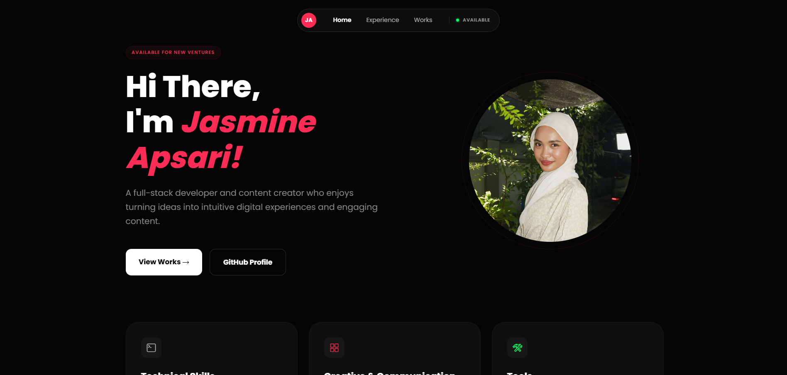
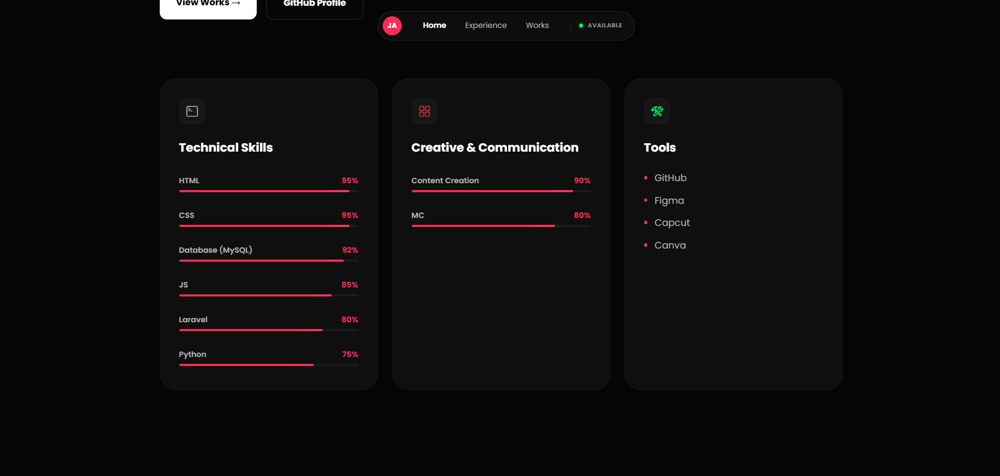
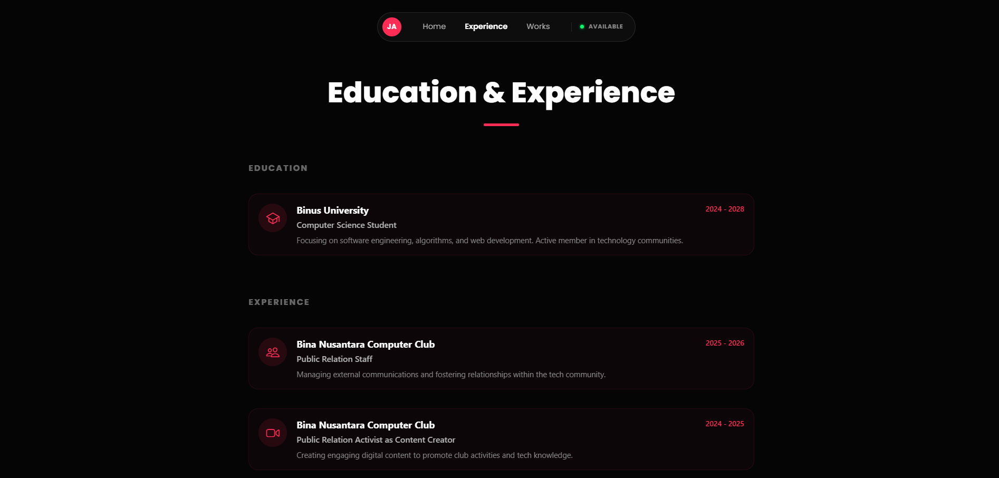
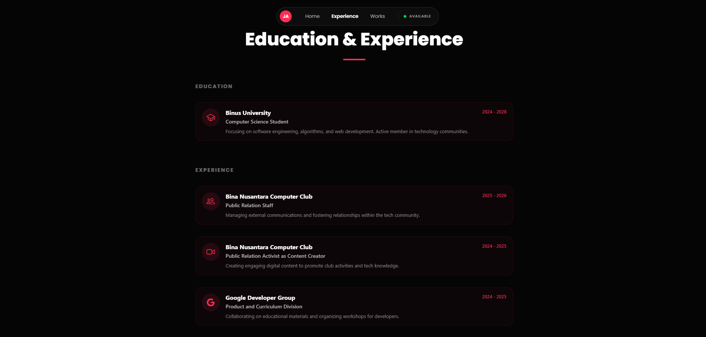
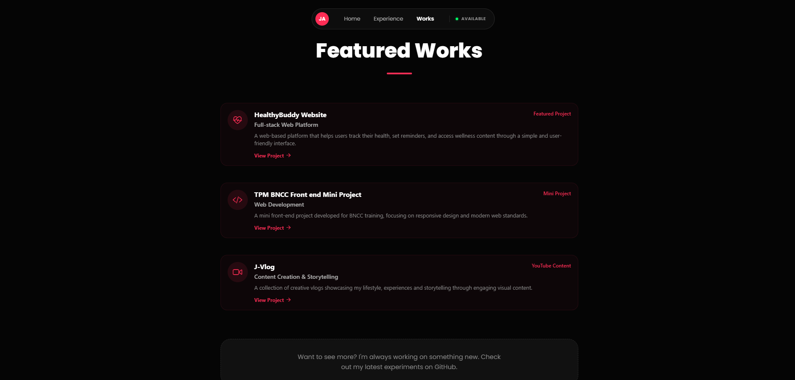

# Jasmine Apsari Assignment Web-Portfolio (Popular Programming Technology)

Personal portfolio website built with **React Native Web (Expo)**.

## Screenshots
### Intro & Hero Section


### Interactive Skills


### Education & Experience



### Featured Works


## How to Run Locally
1. Clone the repository:
   ```bash
   git clone https://github.com/Jasmine-Apsari/cv-ppt.git
   ```
2. Install dependencies:
   ```bash
   npm install
   ```
3. Start the development server:
   ```bash
   npm run web
   ```
